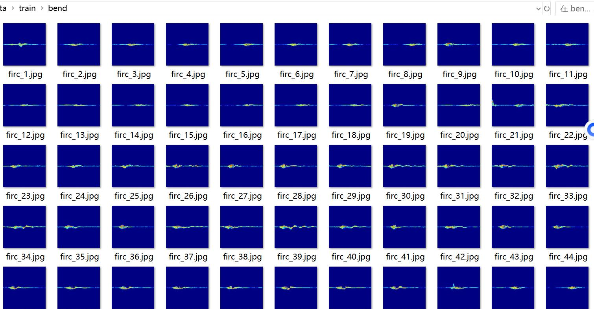
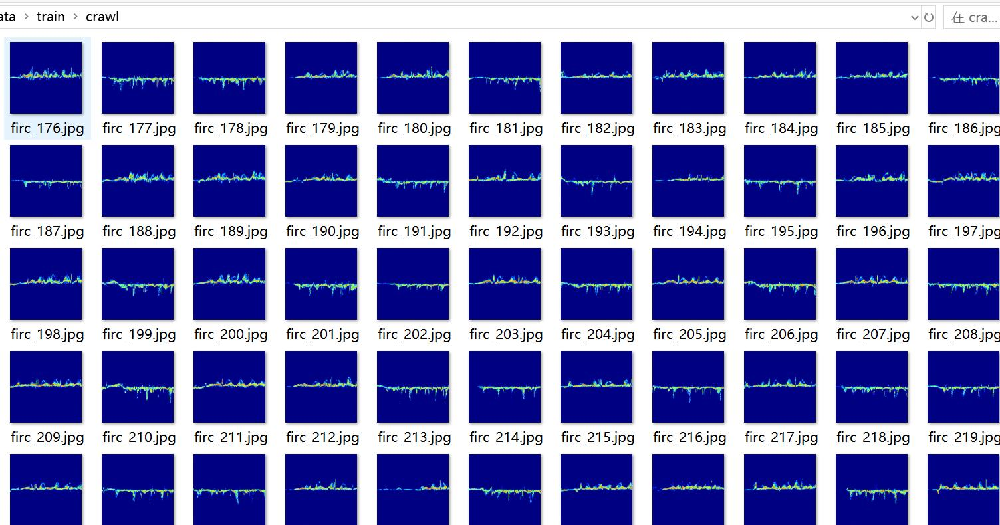
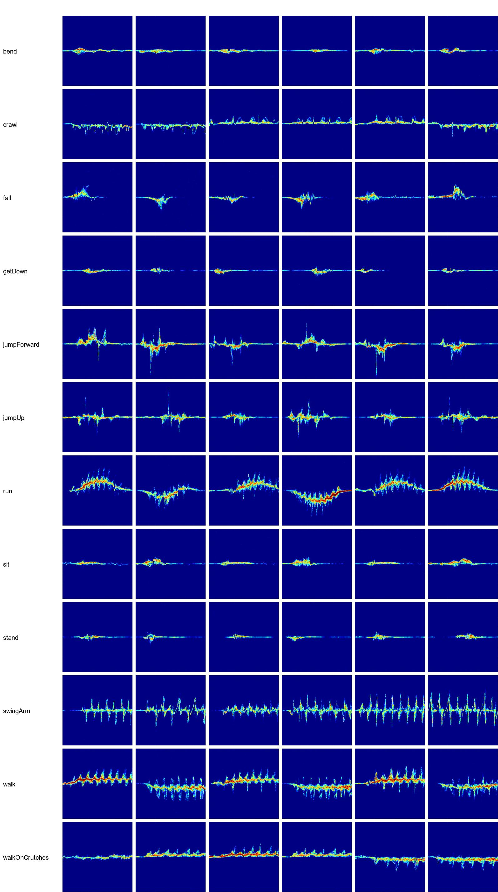

# Millimeter-Wave Human Action and Posture Classification Dataset with 3057 Images in 12 Classes

Dataset Type: Image Classification, not suitable for Object Detection with Unlabeled Files
Dataset Format: Only contains JPG images, each category folder contains corresponding images.
Number of Images (Total JPG Files): 3057
Number of Categories: 12
Category Names: ['bend', 'crawl', 'fall', 'getDown', 'jumpForward', 'jumpUp', 'run', 'sit', 'stand', 'swingArm', 'walk', 'walkOnCrutches']
Image Count per Category:
Training Set Image Count: 2141
Training Set Image Count: 2141
- bend (Bend) Training Set Image Count: 175
- crawl (Crawl) Training Set Image Count: 182
- fall (Fall) Training Set Image Count: 184
- getDown (Get Down/Squat) Training Set Image Count: 185
- jumpForward (Jump Forward) Training Set Image Count: 176
- jumpUp (Jump Up) Training Set Image Count: 176
- run (Run) Training Set Image Count: 173
- Sit training set image count: 178
- Stand training set image count: 186
- Swing Arm training set image count: 184
- Walk training set image count: 171
- Walk on crutches training set image count: 171
validation set image count: 612  
- Bend (Bending) validation set image count: 52
- Crawl (Crawling) validation set image count: 47
- Fall (Falling) validation set image count: 47
- Get Down (Getting Down/Downward Stretch) validation set image count: 56
- Jump Forward (Jumping Forward) validation set image count: 48
- Jump Up (Jumping Up) validation set image count: 53
- Run (Running) validation set image count: 60
- Sit (Seated) validation set image count: 41
- Stand (Standing) validation set image count: 51
- SwingArm validation set image count: 50
- Walk validation set image count: 52
- Walk on crutches validation set image count: 55
Test set image count: 304
- Bend validation set image count: 29
- Crawl validation set image count: 22
- Fall validation set image count: 25
- Get Down validation set image count: 15
- Jump Forward validation set image count: 32
- Jump Up validation set image count: 27
- Run validation set image count: 21
- Sit validation set image count: 35
- Stand validation set image count: 18
- SwingArm validation set image count: 21
- Walk validation set image count: 30
- Walking on crutches (using crutches) test set image count: 29
total images:   
- bendtotal image count: 256
- crawltotal image count: 251
- falltotal image count: 256
- getDowntotal image count: 256
- jumpForwardtotal image count: 256
- jumpUptotal image count: 256
- runtotal image count: 254
- sittotal image count: 254
- standtotal image count: 255
- swingArmtotal image count: 255
- walktotal image count: 253
- walkOnCrutchestotal image count: 255
Important Notes:
Special Statement: This dataset does not guarantee the accuracy of the trained model or weight file.
Image preview:
## Images

Here is a pay link on Stripe ( https://buy.stripe.com/3cs8yP7sY87d0vu9AB ). Please contact me lonlonago@foxmail.com after funding $89, and I will send you a complete data files , thank you!

